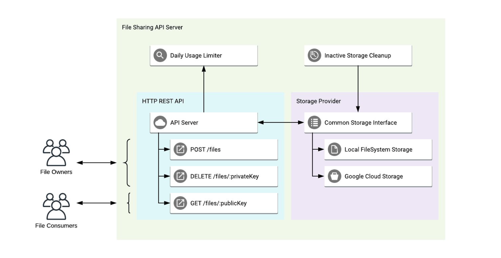

# Project Name

Brief description of your backend project.

## Table of Contents

- [Overview](#overview)
- [Diagram](#diagram)
- [Getting Started](#getting-started)
  - [Prerequisites](#prerequisites)
  - [Installation](#installation)
- [Endpoints](#endpoints)
  - [1. POST /user/register](#1-post-userregister)
  - [2. POST /user/login](#2-post-userlogin)
  - [3. DELETE /user/remove-account](#3-delete-userremove-account)
  - [4. POST /files](#4-post-files)
  - [5. GET /files/:publicKey](#5-get-filespublickey)
  - [6. DELETE /files/:privateKey](#6-delete-filesprivatekey)
- [Configurable Daily Limits](#configurable-daily-limits)
- [Cleanup](#cleanup)
- [Testing](#testing)

## Overview
 The API Server project is designed to provide a robust and flexible file management system through HTTP REST API endpoints. The primary functionalities include uploading new files, downloading existing files, and removing files. The project adheres to best practices by implementing modular components, enabling easy extension to various storage providers, and ensuring robustness through configurable limits and cleanup mechanisms.

## Diagram


## Getting Started

### Prerequisites
Before setting up and running the Node.js File Sharing API Server project, ensure that your development environment meets the following prerequisites:

1. **Node.js:**
    - Minimum Node.js version 20 is required.
    - Install Node.js using a version manager like [nvm](https://github.com/nvm-sh/nvm).
        ```bash
        nvm install 20
        ```
2. **npm (Node Package Manager):**
   - npm is included with Node.js. Verify the npm version:

     ```bash
     npm -v
     ```
3. **Environment Variables:**
   - Create a `.env` file in the project root to store environment-specific configurations. The following variables are required:

     ```env
        PROVIDER=local # Set the provider to 'local' for upload file in the local storage. Default is local storage.
        FOLDER=./uploads #local file upload directory
        MAX_UPLOAD_REQUESTS=50 # daily upload limit
        MAX_DOWNLOAD_REQUESTS=50 # daily download limit
        CLEANUP_CRON='0 0 * * *' #set your valid daily corn to remove inactive file. Default is '0 0 * * *' (Every day at 12.00 AM)
        PORT=3000 # server port

        # Database configuration
        DATABASE_HOST=localhost 
        DATABASE_PORT=3307
        DATABASE_USERNAME=admin
        DATABASE_PASSWORD=admin
        DATABASE_NAME=meldcx

        # Run migration files when run the project. 0 = false, 1 = true; default 1;
        MIGRATION_ENABLED=1

        # JWT private key
        JWT_PRIVATE_KEY_LOCAL=7Vlo8B43hkWWFa3J
        JWT_PRIVATE_KEY_PRODUCATION=7Vlo8B43hkWWF

        # Types of supported environment local, production, test.
        ENVIRONMENT = local
     ```


4. **Database (MySQL):**
    - This project interacts with a MySQL database. Ensure you have run the MySQL docker container. Follow the steps below to run MYSQL container:
    **Database Setup:**
        ```bash
        docker run -d --name mysql -p 3307:3306 -e MYSQL_ROOT_PASSWORD=admin -e MYSQL_DATABASE=meldcx -e MYSQL_USER=admin -e MYSQL_PASSWORD=admin mysql:latest
        ```
5. **Installation & Run**
    1. Install all dependencies

        ```bash
        npm install
        ```
    2. Database Migrations:

        ```bash
        npm run migrate:up
        ```

    3. Run project:

        **Production mode:**
        ```bash
        npm start
        ```

        **Development mode:**
        ```bash
        npm run dev
        ```
# Endpoints
## 1. POST /user/register
### Description
Register a new user account.
### Request
- **Method:** POST
- **Endpoint:** `/user/register`
- **Content-Type:** application/json
### Request Body
```json
{
    "first_name": "your first name",
    "last_name": "your last name",
    "email": "your valid email address",
    "password": "your password (min 5 character)",
    "confirm_password": "your confirm password (min 5 character)"
}
```

### Response
- **Status Code**: 201 Created
- **Response Body**:
```json
{
    "message": "User created successfully"
}
```

## 2. POST /user/login
### Description
Authenticate and log in a user.
### Request
- **Method:** POST
- **Endpoint:** `/user/login`
- **Content-Type:** application/json
### Request Body
```json
{
    "email": "your valid email address",
    "password": "your password (min 5 character)"
}
```

### Response
- **Status Code**: 200 OK
- **Response Body**: JWT token

## 3. DELETE /user/remove-account
### Description
Authenticate and log in a user.
### Request
- **Method:** DELETE
- **Endpoint:** `/user/remove-account`
- **Authorization Header**: Bearer Jwt_token

### Response
- **Status Code**: 202 Accepted
- **Response Body**:
    ```json
    {
        "message": "Account removed successfully"
    }
    ```

## 4. POST /files
### Description
Upload a new file.
### Request
- **Method:** POST
- **Endpoint:** `/files`
- **Content-Type:** multipart/form-data
- **Authorization Header**: Bearer Jwt_token

### Request Body
- Form Data:
    - `file`: (File)
### Response
- **Status Code**: 202 Accepted
- **Response Body**:
    ```json
    {
    "publicKey": "file_public_key",
    "privateKey": "file_private_key"
    }
    ```
## 5. GET /files/:publicKey
### Description
Download an existing file.

### Request
- **Method**: GET
- **Endpoint**: `/files/:publicKey`
### Response
- **Status Code**: 200 OK
- **Response Body**: (File Stream)

## 6. DELETE /files/:privateKey
### Description
Remove an existing file.

### Request
- **Method**: DELETE
- **Endpoint**: `/files/:privateKey`
- **Authorization Header:** Bearer jwt_token

### Response
- **Status Code**: 200 OK
- **Response Body**
    ```json
    {
        "message": "File removed successfully"
    }
    ```

## Configurable Daily Limits:
The API Server implements configurable daily download and upload limits for network traffic from the same IP address. This ensures control and security over the usage of the API. The default daily upload limit is 50 and download limit is 200.

## Cleanup
The API Server incorporates an internal job to clean up uploaded files more than 6 months ago. This feature ensures efficient resource utilization and prevents unnecessary storage occupation.

## Testing
Testing using the `npm test` command.